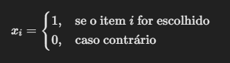
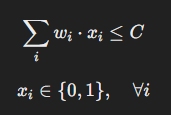
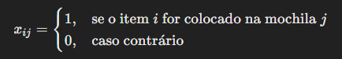
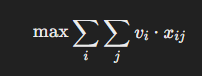
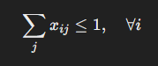
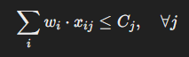
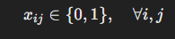

## 🎒 **Problema da Mochila com Otimização Linear**

### 🔍 **Descrição**
O **Problema da Mochila** é um problema clássico de **otimização combinatória**, onde temos uma mochila com capacidade limitada e um conjunto de itens, cada um com um **peso** e um **valor**. O objetivo é determinar quais itens colocar na mochila para **maximizar o valor total**, sem ultrapassar a capacidade máxima.

Este projeto resolve:
- ✅ **Problema da Mochila Simples**  
- ✅ **Problema da Mochila Múltipla** (quando temos várias mochilas disponíveis)

Utilizamos **Python e PuLP** para modelar e resolver o problema.

---

## 📊 **Formulação Matemática**
### 🎒 **Problema da Mochila (Knapsack Problem)**

Dado um conjunto de itens \( i \) com:
- **Valor** \( v_i \)
- **Peso** \( w_i \)
- **Capacidade máxima da mochila** \( C \)

A variável de decisão é:



A formulação do problema é:


**Sujeito a:**



---

### 🎒 **Problema da Mochila Múltipla (Multiple Knapsack Problem)**

Agora temos **várias mochilas** \( j \), cada uma com uma **capacidade \( C_j \)**, e cada item pode ser colocado em **apenas uma delas**.

A variável de decisão agora é:


A formulação fica:



**Restrições:**
1. Cada item pode estar em no máximo **uma mochila**:



2. A soma dos pesos dos itens não pode ultrapassar a capacidade de cada mochila:



3. As variáveis de decisão são binárias:



---

## 🚀 **Tecnologias Utilizadas**
- Python 🐍
- PuLP (para modelagem e solução do problema)
- Pandas 🐼
---

## ⚙️ **Instalação**
1. Clone o repositório:
   ```sh
   git clone https://github.com/vncsferreiraguiar/otimizacao-operacional
   ```

2. Crie e ative o ambiente virtual:
   ```sh
   python -m venv venv
   source venv/bin/activate  # macOS/Linux
   venv\Scripts\activate  # Windows
   ```

3. Instale as dependências:
   ```sh
   pip install pulp
   pip install pandas
   pip install openpyxl
   ```

---

## 📌 **Uso**
Execute o script principal:

```sh
python mochila_unica.py
```
```sh
python mochila_multipla.py
```

Saída esperada (exemplo):

```
Itens Selecionados:

 Mochila_1
 - Item_1 (Peso: 10.5 KG, Valor: R$ 120.0)
 - Item_4 (Peso: 9.8 KG, Valor: R$ 110.3)
 - Item_5 (Peso: 11.3 KG, Valor: R$ 128.9)
 - Item_9 (Peso: 8.9 KG, Valor: R$ 98.75)
 - Item_10 (Peso: 9.5 KG, Valor: R$ 105.6)

Peso Total: 50.00 KG
Valor Total: R$ 563.55

 Mochila_2
 - Item_3 (Peso: 12.2 KG, Valor: R$ 135.75)
 - Item_6 (Peso: 7.5 KG, Valor: R$ 85.4)
 - Item_8 (Peso: 10.1 KG, Valor: R$ 118.25)

Peso Total: 29.80 KG
Valor Total: R$ 339.40
```

---

## 📚 **Referências**
- 📚 Introdução à Otimização: [Wikipedia - Problema da Mochila](https://pt.wikipedia.org/wiki/Problema_da_mochila)
- 📚 Documentação do PuLP: [https://coin-or.github.io/pulp/](https://coin-or.github.io/pulp/)

---

## 📢 **Contribuição**
Sinta-se à vontade para abrir **issues** e enviar **pull requests**! 🚀

